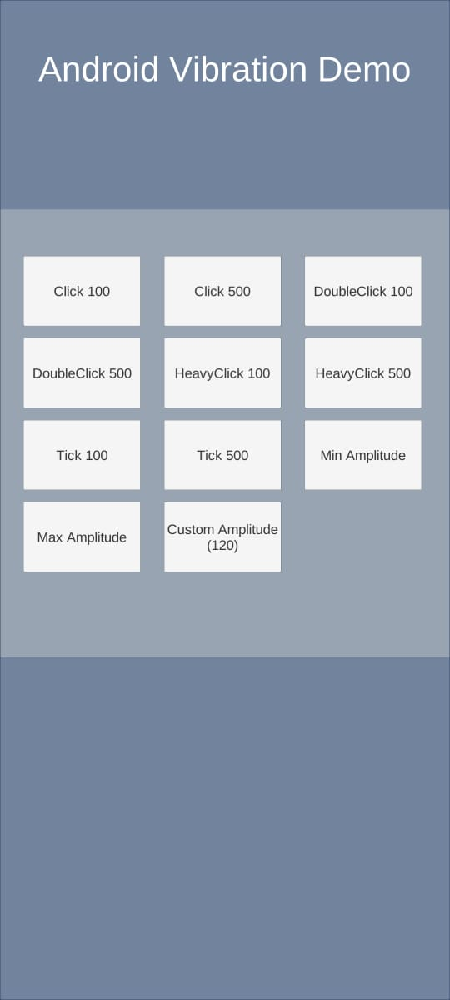

# Unity3D android vibration demo
Download package from [release page](https://github.com/codemaker2015/unity3d-android-vibration-dmeo/releases).

### Demo


### Sample Code
You can use these functions to make vibrations in your game:

```c#
VibrationHelper.VibrateClick(milliseconds); // Vibrate with Click Effect amplitude
VibrationHelper.VibrateDoubleClick(milliseconds); // Vibrate with Double Click Effect amplitude
VibrationHelper.VibrateHeavyClick(milliseconds); // Vibrate with Heavy Click Effect amplitude
VibrationHelper.VibrateTick(milliseconds); // Vibrate with Tick Effect amplitude
```
These predefined effects work on Android API 29. For other custom Amplitude use this function:

```c#
VibrationHelper.VibrateWithAmplitude(milliseconds, amplitude);
```
> amplitude must be a value between 1 and 255

You can use ``` VibrationHelper.minAmplitude ``` (=1)and ``` VibrationHelper.maxAmplitude```(=255) for getting min and max amplitude.
